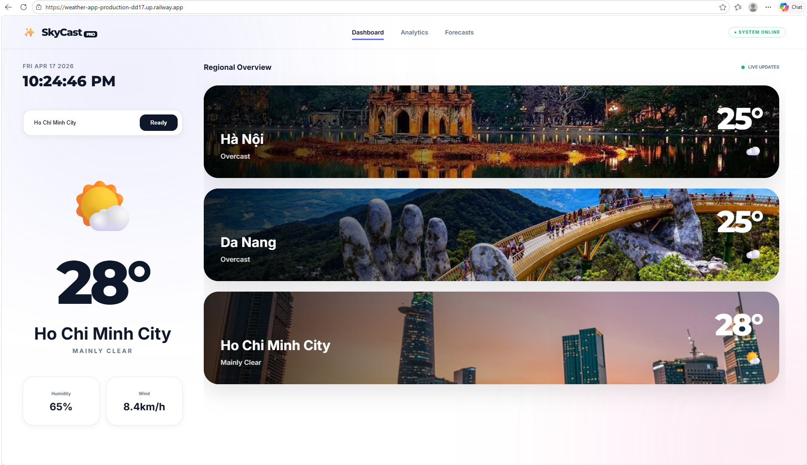

#  Delivery Checklist — Day 12 Lab Submission

> **Student Name:** Trần Minh Toàn 
> **Student ID:** A202600297  
> **Date:** 17/4/2026


# 🚀 SkyCast Pro - Deployment Information

Thông tin triển khai hệ thống dự báo thời tiết chuyên nghiệp.

## 🌐 Public URL
Bạn có thể truy cập ứng dụng trực tiếp tại:
**https://weather-app-production-dd17.up.railway.app/**
*(Lưu ý: Nếu bạn đã thay đổi tên project, hãy thay link này bằng Domain trong tab Settings của Railway)*

## ☁️ Platform
- **Hosting**: [Railway.app](https://railway.app/)
- **Infrastructure**: Docker Container (Multi-stage build)
- **Backend**: FastAPI (Python 3.11)
- **Frontend**: React (Vite)

## 🧪 Test Commands (Lệnh kiểm tra)

### 1. Health Check (Kiểm tra trạng thái)
Dùng lệnh này để xem server có đang hoạt động tốt không:
```bash
curl https://weather-app-production.up.railway.app/api/health
```
**Kết quả mong đợi:** `{"status": "healthy", "service": "skycast-backend"}`

### 2. API Weather Test (Kiểm tra thời tiết)
Lệnh kiểm tra dữ liệu thời tiết thực tế (yêu cầu API Key nội bộ):
```bash
curl -H "x-api-key: super-secret-key" "https://weather-app-production.up.railway.app/api/weather?city=Hanoi"
```

### 3. API Search Test (Kiểm tra tìm kiếm)
Lệnh kiểm tra tính năng gợi ý thành phố:
```bash
curl "https://weather-app-production.up.railway.app/api/search?q=Danang"
```

## 🔐 Environment Variables
Các biến môi trường đã được cấu hình trên Railway:
- `PORT`: 8000
- `API_AUTH_KEY`: super-secret-key
- `OPENWEATHER_API_KEY`: (Tùy chọn - Hiện đang dùng Open-Meteo miễn phí)

## 📸 Screenshots
- **Dashboard**: Hiển thị 3 miền Bắc - Trung - Nam.
- **Search**: Tính năng gợi ý Autocomplete hoạt động mượt mà.
- **Pro UI**: Giao diện Glassmorphism trắng sang trọng.

